= Entwicklerdokumentation
:toc:
:toc-title: Inhaltsverzeichnis
:numbered:

[options="header"]
[cols="1, 3, 3"]
|===
|Version | Bearbeitungsdatum   | Autor 
|0.1	 | 05.11.2023          | Steve, Darius
|===

== Einführung und Ziele

=== Aufgabenstellung

Im Rahmen des Software-Technologie-Projekts 2023 soll folgende Aufgabe bearbeitet werden:

In einem Laden für Uhren gibt es zwei getrennte Bereiche: Verkauf und Reparatur. Für beide Bereiche
ist entsprechend qualifiziertes Personal nötig.
Im Verkaufsbereich werden Waren angeboten, z.B. Armband- und Taschenuhren, Wecker,
Wanduhren oder Kaminuhren. Das Angebot richtet sich nach aktuellen Trends und Nachfrage der
Kunden und wird in entsprechend benötigten Stückzahlen bei den verschiedenen Herstellern
geordert. Im Lager sind also verschieden große Mengen der Waren vorrätig, in regelmäßigen
Abständen werden Ladenhüter aussortiert und als Verlust verbucht. Es ist auch möglich, Standuhren
zu kaufen. Die werden jedoch vom Kunden individuell aus den Katalogen entsprechender Anbieter
ausgewählt und erst dann bestellt. Neben den Uhren kann man im Laden auch Zubehör (Armbänder,
Batterien etc.) und eine kleine Auswahl an Modeschmuck kaufen. Bringt ein Kunde eine Uhr zur
Reparatur, werden seine Daten aufgenommen und er bekommt eine Auftragsbestätigung. In der
Werkstatt bearbeitet der Uhrmacher alle eingehenden Aufträge nacheinander (Ausnahme: Ein Kunde
wünscht gegen Aufpreis die Reparatur im 24h-Service). Ist die Reparatur erledigt, gibt er den
Materialverbrauch und die benötigte Zeit an. Daraus berechnet sich der Preis und alles zusammen
wird in einer Rechnung für den Kunden zusammengestellt. Der Kunde wird benachrichtigt, sobald
seine Uhr fertig ist. Auch Radiowecker werden zur Reparatur entgegengenommen, diese kann aber
nicht in der eigenen Werkstatt erfolgen. Die Geräte werden zum Hersteller geschickt und von diesem
repariert oder ersetzt, sofern noch Garantieanspruch besteht.
Dem Besitzer des Uhrenladens muss es möglich sein:

* Bestellungen bei den verschiedenen Herstellern zu tätigen
* Verbrauchsmaterial der Werkstatt zu überwachen und nachzubestellen
* das Lager zu führen
* Personal einzustellen und zu entlassen,
* Stundensätze der Uhrmacher festzulegen/zu ändern,
* Abrechnungen (Tag/Monat/Jahr) zu erstellen.

Zukünftig will der Uhrenladen auch einen Wartungsservice für Turm- und Gebäudeuhren anbieten.
Dazu wird mit einem Kunden ein Vertrag geschlossen und je nach Art und Anzahl der Uhren ein
Pauschalbetrag festgesetzt. Materialkosten für eventuell notwendige Reparaturen werden zusätzlich
berechnet. Das Material für Wartung und Reparaturen ist in den Bestellungen zu berücksichtigen,
außerdem muss zusätzliches Personal eingestellt werden.

=== Qualitätsziele

[options="header", cols="4, 1, 1, 1, 1, 1"]
|===
| Qualitätsanforderung  | 1 | 2 | 3 | 4 | 5
| Nutzbarkeit           |  |  |  | x |
| Sicherheit            |  |  |  | x |
| Speicher              |  | x |  |  |
| Übersichtlichkeit     |  |  | x |  |
| Fehlertoleranz        |  |  | x |  |
| Korrektheit           |  |  |  |  | x
| Erweiterbarkeit       |  |  |  |  | x
|===

== Randbedingungen
=== Hardware-Vorgaben
Liste nötiger Geräte/Hardware um das System zu betreiben und zu benutzen.

* Server
* Computer
* Maus
* Tastatur

=== Software-Vorgaben
Folgende java Version wird für das System vorrausgesetzt.

    Java 19

Das System soll für folgende Browser nutzbar und visuell aufbereitet sein:

    Mozilla Firefox, version 92.0.1+

    Google Chrome, version 94.0.4606+

=== Produktnutzung

Die Software dient zur Verwaltung eines Uhrenladens durch seinen Betreiber, sowie der Erleichterung der Arbeitsabläufe im Unternehmen an und für sich. Dabei soll es auch den Mitarbeitenden Prozesse im Unternehmen erleichtern.

== Kontextabgrenzung
=== Kontextdiagramm

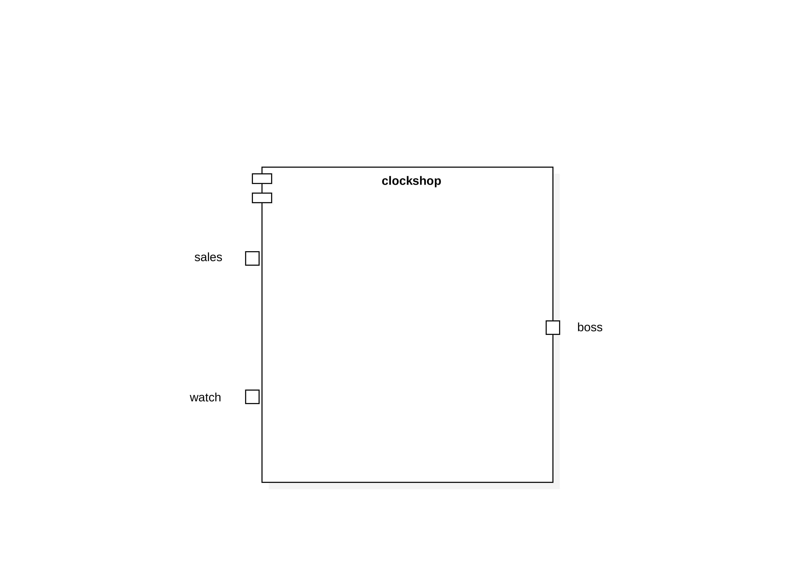

== Lösungsstrategie
=== Erfüllung der Qualitätsziele
[small]_Note: The following table shows the previous defined quality demands and solution approaches to fulfill them._

[options="header"]
|===
|Qualitätsanspruch |Lösungsansatz
|Nutzbarkeit a|
* *Lernbarkeit*: Das System kann intuitiv von seinen Nutzern verstanden werden. Das kann durch Beschriftungen und Tooltips realisiert werden.
* *Nutzungsfehler Schutz / Fehlerverarbeitung*: Nutzer werden vor Nutzungsfehlern geschützt. Ungültige Eingaben führen nicht zu ungültigen Systemzuständen.
* *GUI Übersichtlichkeit*: Es wird eine angenehme und effiziente Interaktion mit dem System gewährleistet.
* *Zugreifbarkeit*: Menschen mit unterschiedlichen visuellen Eigenschaften können das System nutzen. Es wird leicht lesbare Schrift und Farbe verwendet.
|Sicherheit a|
* *Vertraulichkeit*: Daten werden nur Nutzern angezeigt, die autorisierten Zugriff haben. Das wird mit _Spring Security_ und _Thymeleaf_ (`sec:authorize` - tag) realisiert.
* *Integrität*: Die unautorisierte Veränderung von Daten wird verhindert. Mit _Spring Security_ (`@PreAuthorize` - annotation) wird die Gewährleistung garantiert.
* *Verantwortung*: Nachverfolgbarkeit für alle Events. Dafür soll das und das gemacht werden.
| Speicher a|
* *Arbeitsspeicher*: Das System wird wenig Arbeitsspeicher auslasten und gewährt deshalb eine wie gewohnt effiziente Nutzung des Computers.
| Korrektheit a|
* *Datenkonsistenz*: Gespeicherte Daten können von System nicht verändert werden. Daten können vom Nutzer verändert werden.
| Erweiterbarkeit a|
* *Programmerweiterbarkeit*: Auf Wunsch des Kunden kann das System leicht um Komponenten erweitert werden. Das wird durch ein gut strukturiertes Programm gewährleistet.
|===

=== Softwarearchitektur
* Beschreibung der Architektur anhand der Top-Level-Architektur oder eines Client-Server-Diagramms

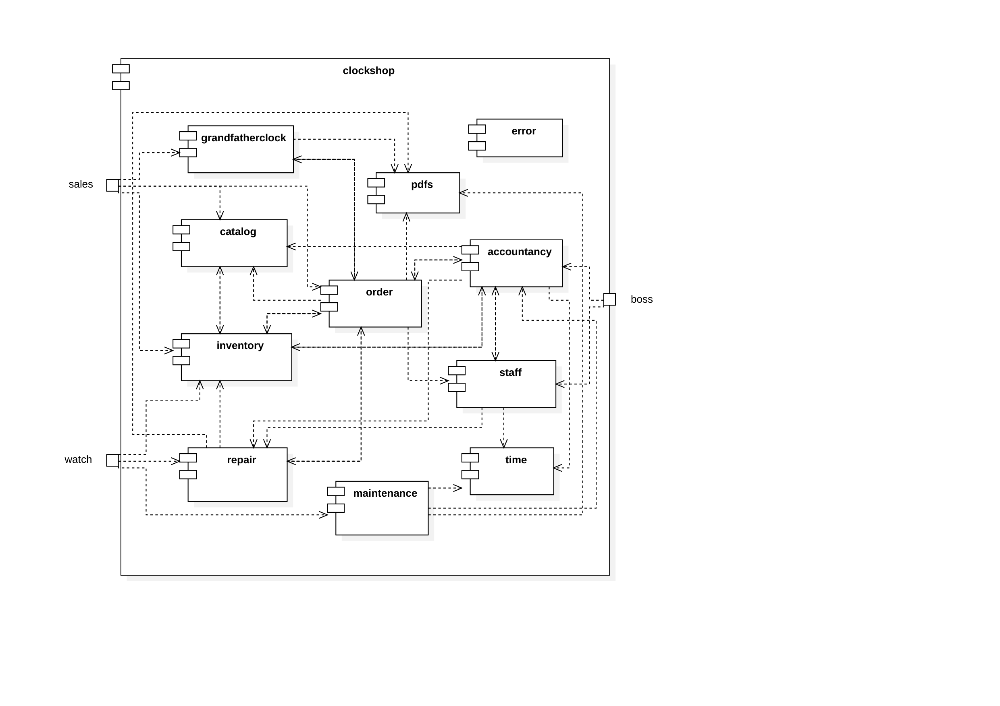

Client-Server Model

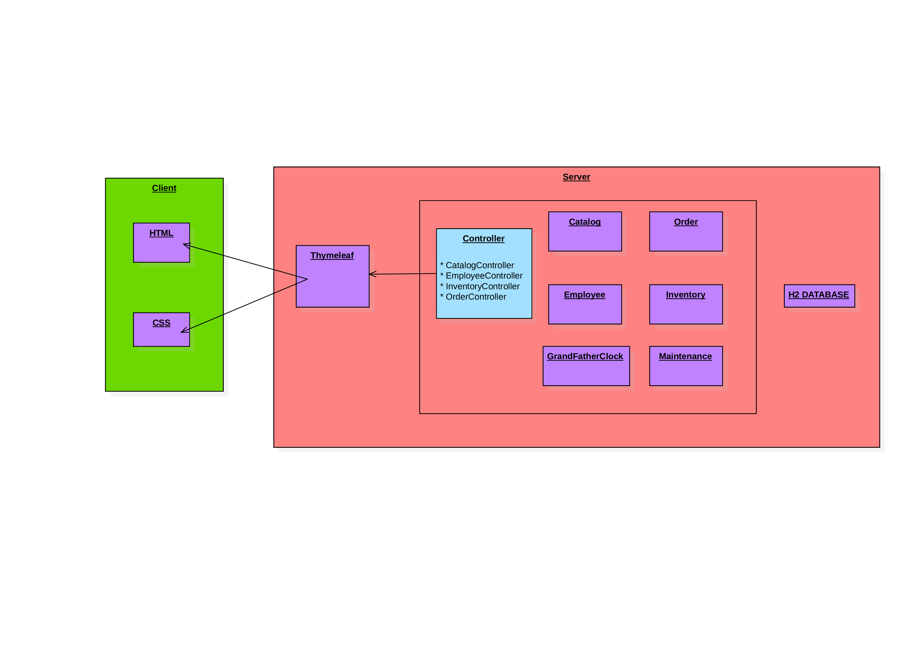

Component-Diagramm

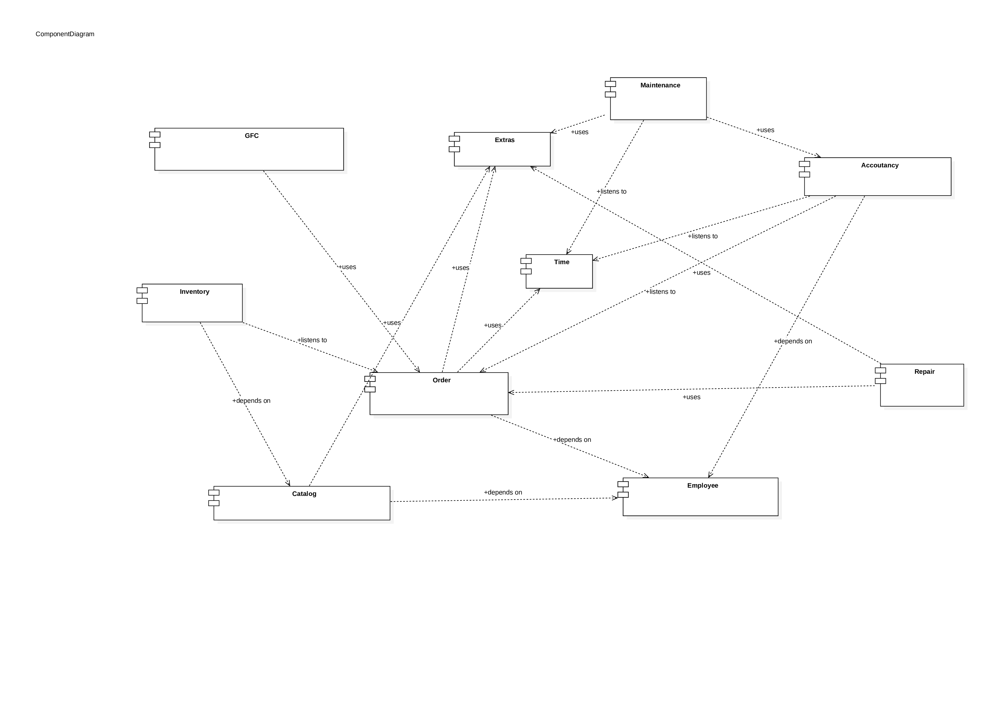

=== Entwurfsentscheidungen
==== Verwendete Muster
* Spring MVC

==== Persistenz

Die Anwendung verwendet eine auf Hibernate-Annotationen basierende Zuordnung, um Java-Klassen Datenbanktabellen zuzuordnen. Als Datenbank wird H2 verwendet. Die Persistenz ist standardmäßig deaktiviert. Um den Persistenzspeicher zu aktivieren, müssen die folgenden beiden Zeilen in der Datei application.properties auskommentiert werden:

* spring.datasource.url=jdbc:h2:./db/clockshop
* spring.jpa.hibernate.ddl-auto=update

==== Benutzeroberfläche

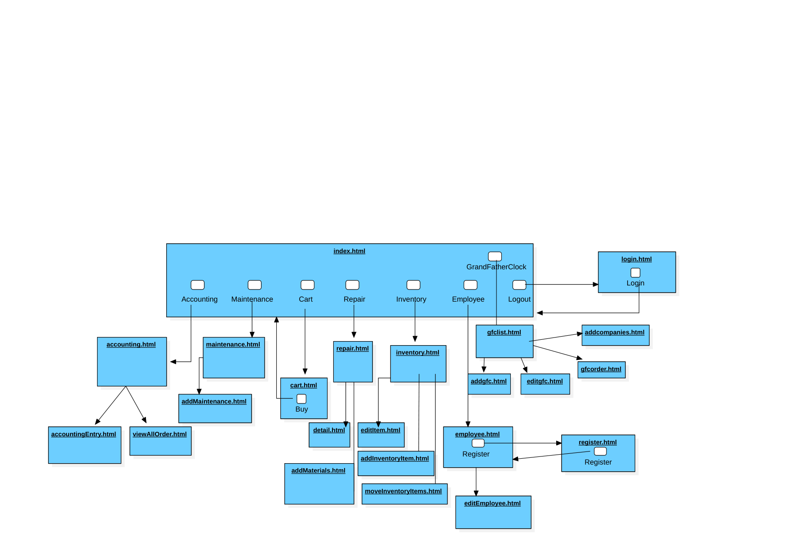

=== Verwendung externer Frameworks

[options="header", cols="1,2,3"]
|===
|Externes Package |Verwendet von |Warum
|org.springframework.boot a|
* clockshop
| Einfache Konfiguration einer Spring-Anwendung
|org.springframework.web a|
* clockshop
* clockshop.catalog
* clockshop.inventory
* clockshop.order
| Die Anwendung sollte als statische Website bereitgestellt werden.
|org.springframework.security a|
* clockshop
* clockshop.inventory
* clockshop.order
* clockshop.accountancy
| JPA-Verbindungsdienst für die Datenbankebene
|org.salespointframework a|
* clockshop
* clockshop.catalog
* clockshop.customer
* clockshop.inventory
* clockshop.order
* clockshop.accountancy
| Die Wiederverwendung der POS-Funktionalität von SalesPoints

|===

== Bausteinsicht
* Package-Diagramm
* Entwurfsklassendiagramme der einzelnen Packages
[options="header", cols="1,2"]
|=== 
|Klasse/Enumeration |Description

|===

=== Uhrenladen (allgemein)

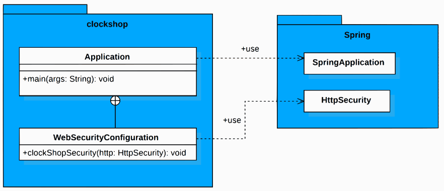

=== Order

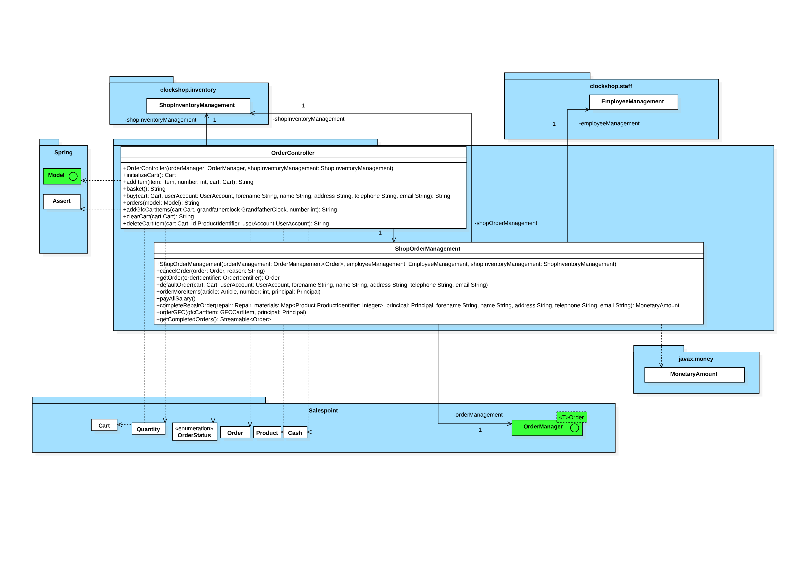
[options="header"]
|===
|Class/Enumeration |Description
|OrderController | Spring MVC Controller der den Warenkorb verwaltet
|ShopOrder | Salespoint Order mit mehr Attributen
|ShopOrderManagement | Service der Order-Completions verwaltet
|===

=== Reparatur
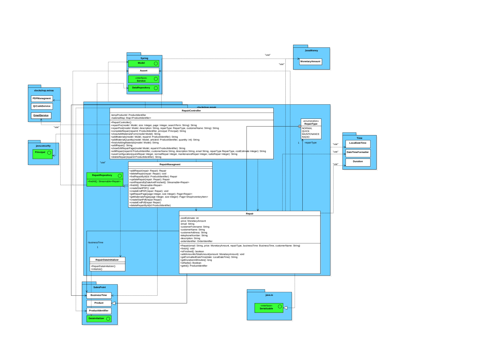
[options="header"]
|===
|Class/Enumeration |Description
|RepairController | Spring MVC Controller der Reparatur verwaltet
|Repair | Klasse die Reparatur darstellt
|RepairManager | Klasse welche die Liste der Reparaturen darstellt
|RepairDataInitializer| Erstellt Beispiel-Daten für Repair
|RepairType |Enum aller möglichen Typen von Repair
|===

=== Personal
image::./models/design/diagrams/StaffDiagram.png[]
[options="header"]
|===
|Class/Enumeration |Description
|EmployeeController | Spring MVC Controller der das Personal verwaltet
|Employee | Klasse, die den Mitarbeitenden darstellt
|RegistrationForm | Schnittstelle, die zur validierung eines neuen Employee dient
|EmployeeDataInitializer | Erstellt Beispielnutzer
|EmployeeRepository | Enthält die Daten aller registrierten Benutzer
|===
=== Catalog

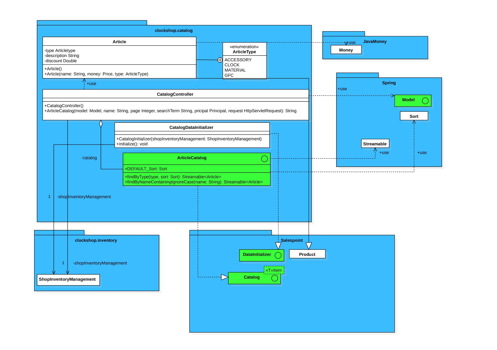
[options="header"]
|===
|Class/Enumeration      |Description
|CatalogController      |Spring MVC Controller welcher die Anfragen auf Einsicht der Artikel verwaltet
|CatalogInitializer     |Implementation des DataInitializer um Beispielitems zu erstellen
|Article                |Klasse um Artikel des Uhrenladens zu beschreiben, erweitert Produkt aus Salespoint
|ArticleType            |Enumeration zum Definieren eines Artikels als Uhr oder Accessoire
|ShopInventoryManagement |Klasse aus Inventory Package, um auf Daten vom Inventory zuzugreifen
|===

=== Inventory

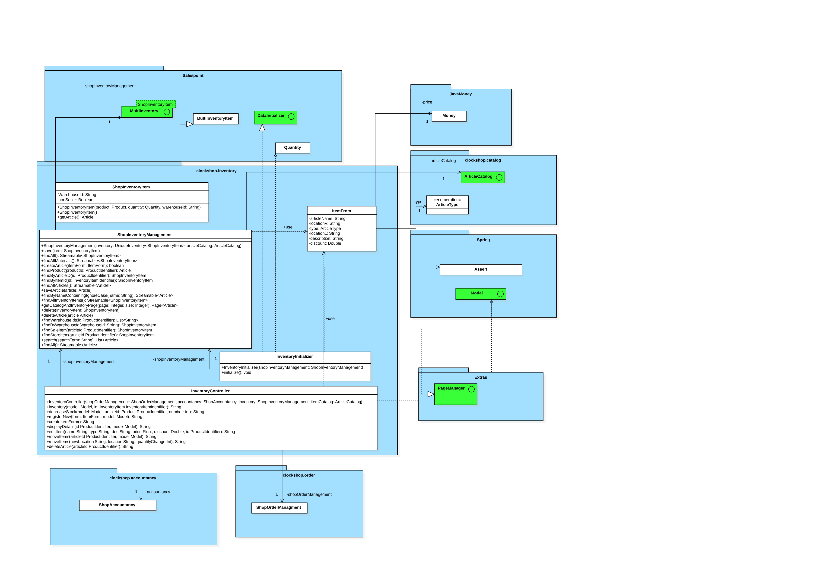
[options="header"]
|===
|Class/Enumeration      |Description
|InventoryController    |Spring MVC Controller welcher die Anfragen auf Einsicht verwaltet
|InventoryInitializer   |Implementation des DataInitializer um Beispieldaten zu erschaffen
|ItemForm               |Formular welches alle nötigen Daten für die Item-Erstellung enthält
|ShopInventory          |Services-Klasse, welche Zugriff auf das Inventory und den Catalog verwaltet
|ShopInventoryItem      |Erweiterung des UniqueInventoryItems enthält eine extra LagerID
|===

=== Accountancy

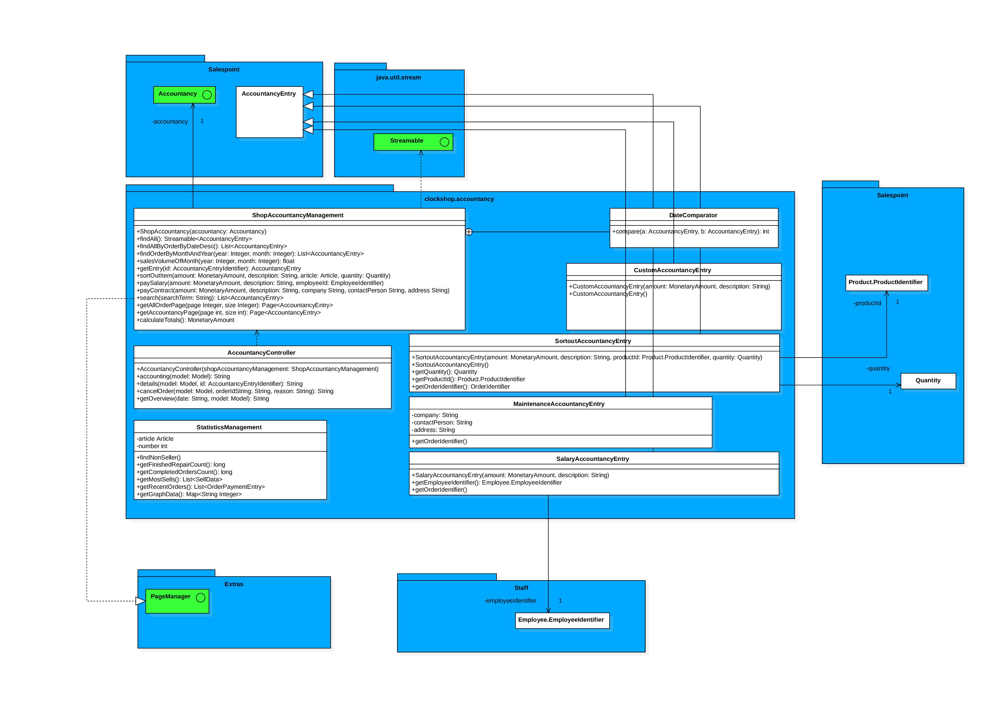
[options="header"]
|===
|Class/Enumeration          |Description
|AccountancyController      |Spring MVC Controller welcher die Anfragen auf Einsicht verwaltet
|ShopAccountancy            |Services-Klasse, welche Zugriff auf die Accountancy verwaltet
|StatisticsManagement|Verwaltet Auswertung von AccountancyEntries
|CustomAccountancyEntry| AccountancyEntry für Erweiterungen
|MaintenanceAccountancyEntry| AccountancyEntry für Maintenance
|SalaryAccountancyEntry| AccountancyEntry für Salary
|SortoutAccountancyEntry| AccountancyEntry für Sortout
|===

=== Maintenance Service

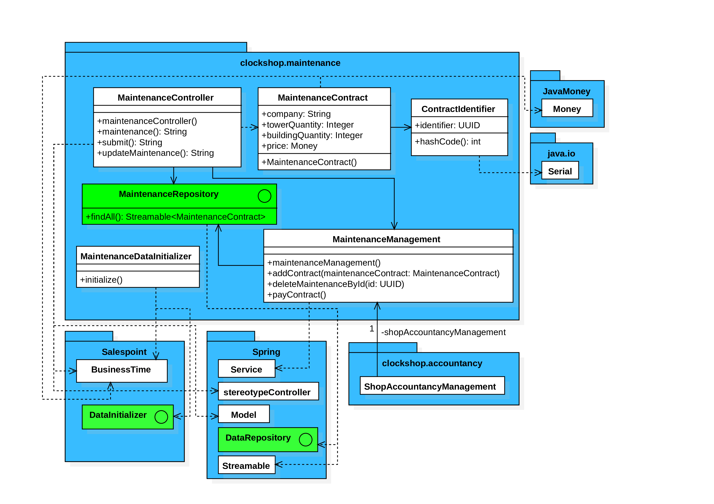

[options="header"]
|===
|Class/Enumeration          |Description
|MaintenanceController      |Spring MVC Controller welcher den Wartungsservice verwaltet
|MaintenanceManagement      |Service Klasse, die Wartungsverträge bearbeitet und speichert
|MaintenanceContract        |Entität die den Wartungsvertrag darstellt, Unterscheidung mit Id
|MaintenanceRepository      |Repository mit allen Wartungsverträgen
|MaintenanceDataInitializer| Erstellt Beispieldaten
|===

=== Grandfather Clocks

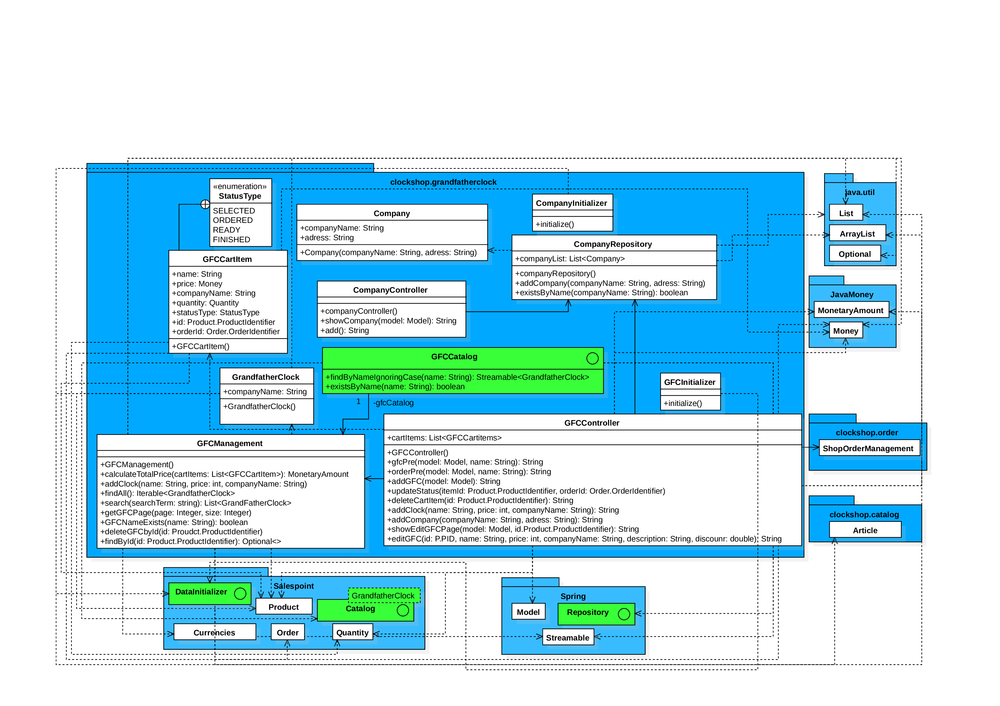

[options="header"]
|===
|Class/Enumeration      |Description
|CompanyController      |Spring MVC Controller der das Repository der Standuhren verwaltet
|CompanyRepository      |enthält alle Firmen
|Company                |Firma als Entität mit Namen und Adresse als Attribut
|GFCController          |Spring MVC Controller der Ansicht auf den GFC Catalog und das Company Repository verwaltet
|GFCManagement          |Service Klasse um GFC Catalog zu bearbeiten
|GFCCatalog             |Repository welches alle Standuhren enthält
|GrandfatherClock       |Entität welche die Produktklasse erweitert
|===
=== Time
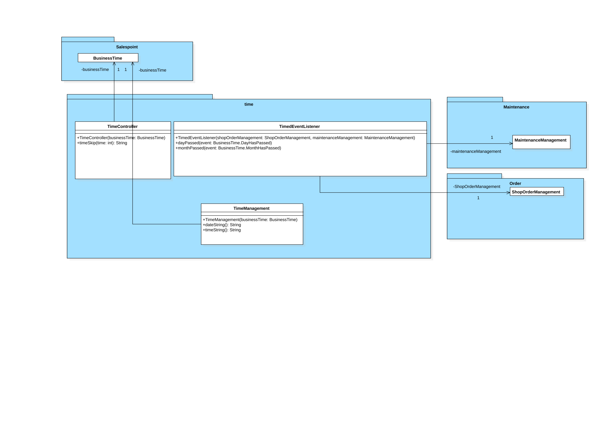

[options="header"]
|===
|Class/Enumeration          |Description
|TimeController             |Verantwortlich für die Time-Skip-Funktion
|TimeEventListener          |Observer für Zeitbasierte funktionen
|TimeManagement             |Service der Umwandlung von Zeitstrings verwaltet
|===

=== Extras
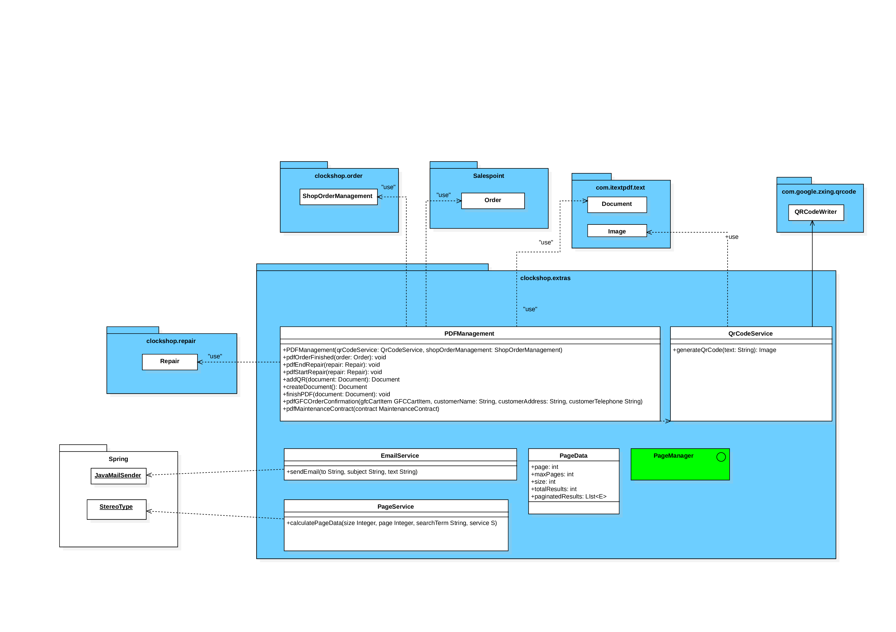

[options="header"]
|===
|Class/Enumeration          |Description
|EmailsService              |Service für das verschjicken von E-Mails
|PageData                   |Objekt genutzt in PageService
|PageManager                |Interface für die Nutzung von Services in PageServices
|PageService                |Klasse welche die berechnung von SeitenDaten zuständig ist
|PFDManagement              |Klasse zuständig für die Erstellung von PDFs
|QRCodeService              |Klasse zuständig für die Erstellung von QRCodes
|===

=== Rückverfolgbarkeit zwischen Analyse- und Entwurfsmodell
_Die folgende Tabelle zeigt die Rückverfolgbarkeit zwischen Entwurfs- und Analysemodell._

[options="header"]
|===
|Klasse/Enumeration (Analysemodell) |Klasse/Enumeration (Entwurfsmodell)
|Registrierter Nutzer(Besitzer/Uhrenmacher/Verkäufer) a|
* salespointframework.userAccount
* salespointframework.Role
|Lager                          |salespointframework.UniqueInventory
|Konto                          |based on accountcy
|Protokoll                      |salespointframework.Accountancy
|Lageritem                      |salespointframework.UniqueInventory
|Uhren                          |clockshop.catalog.Article.ArticleType.CLOCK
|Accessoire                     |clockshop.catalog.Article.ArticleType.ACCESSORY
|Material                       |clockshop.catalog.Article.ArticleType.MATERIAL
|Texttemplate                   |clockshop.extras.PDFManagement. -> alle Methoden
|Rechung                        |clockshop.extras.PDFManagement.pdfOrderFinished
|Auftragsbestätigung            |clockshop.extras.PDFManagement.pdfGFCOrderConfirmation
|Bestellung                     |clockshop.accountancy.SortoutAccountancyEntry
|Wartungsservice                |clockshop.extras.PDFManagement.pdfMaintenanceContract
|Werkstatt                      |clockshop.repair.RepairManager
|Status                         |clockshop.repair.RepairType
|Kunde                          |Data given in clockshop.Order.buy
|===

== Laufzeitsicht
* Darstellung der Komponenteninteraktion anhand eines Sequenzdiagramms, welches die relevantesten Interaktionen darstellt.

=== Order

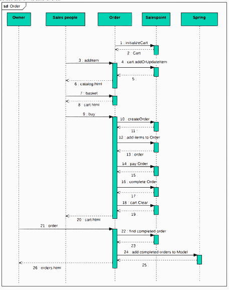

=== Reparatur
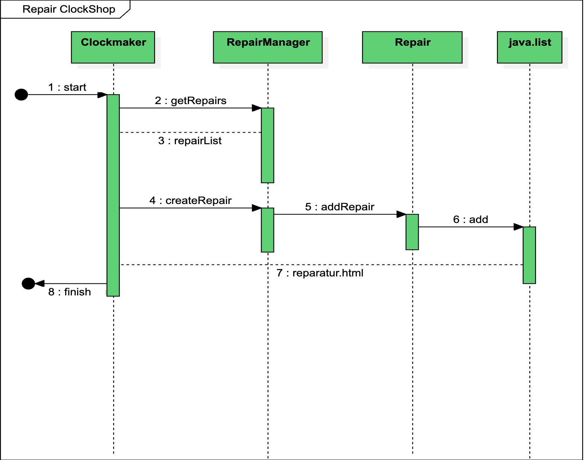

=== Personal
Register:

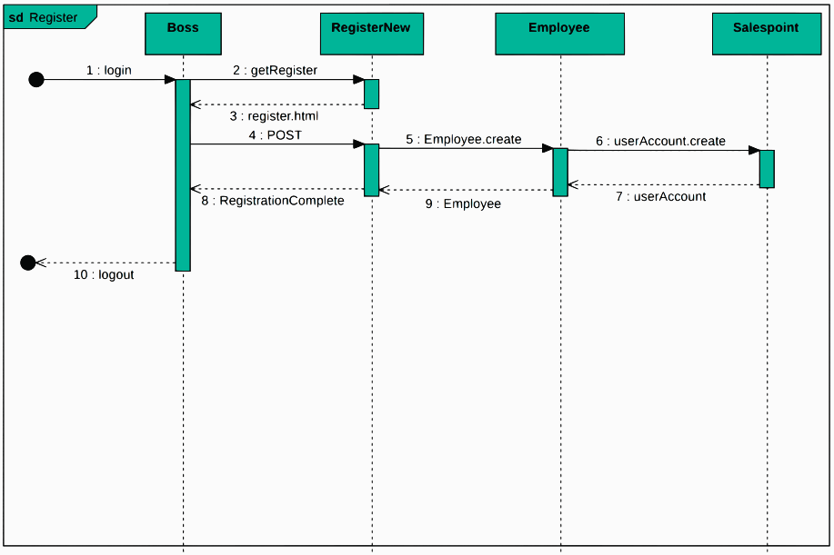

Edit Employee:

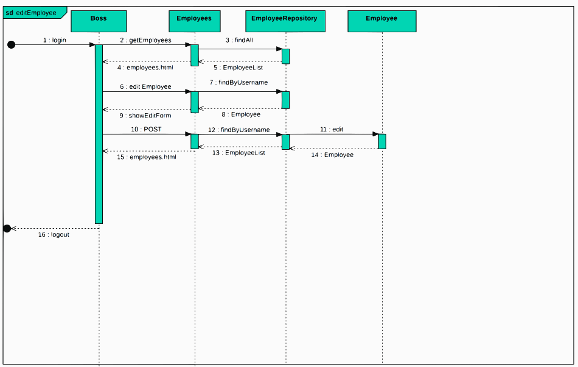

=== Catalog

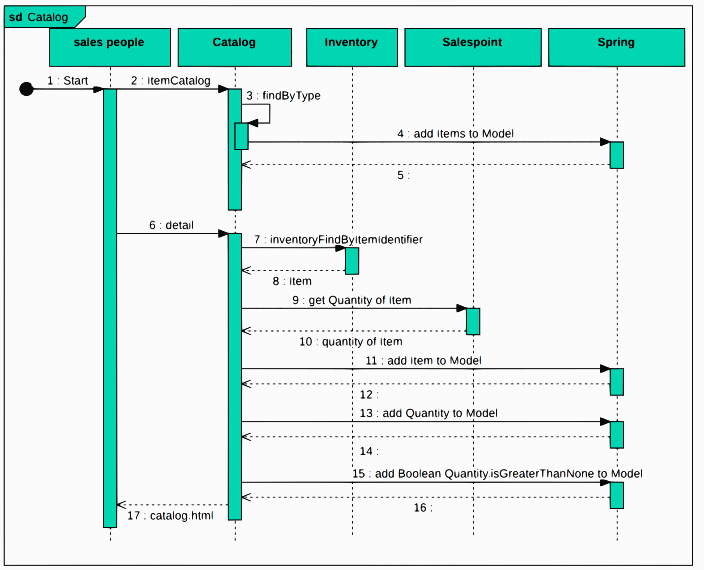

=== Inventory

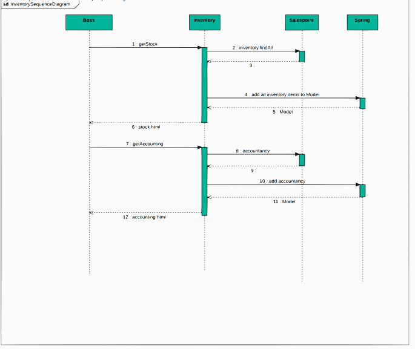

=== Accountancy

//image::./models/design/diagrams/AccountancySequenceDiagram.png[]

=== Maintenance Service

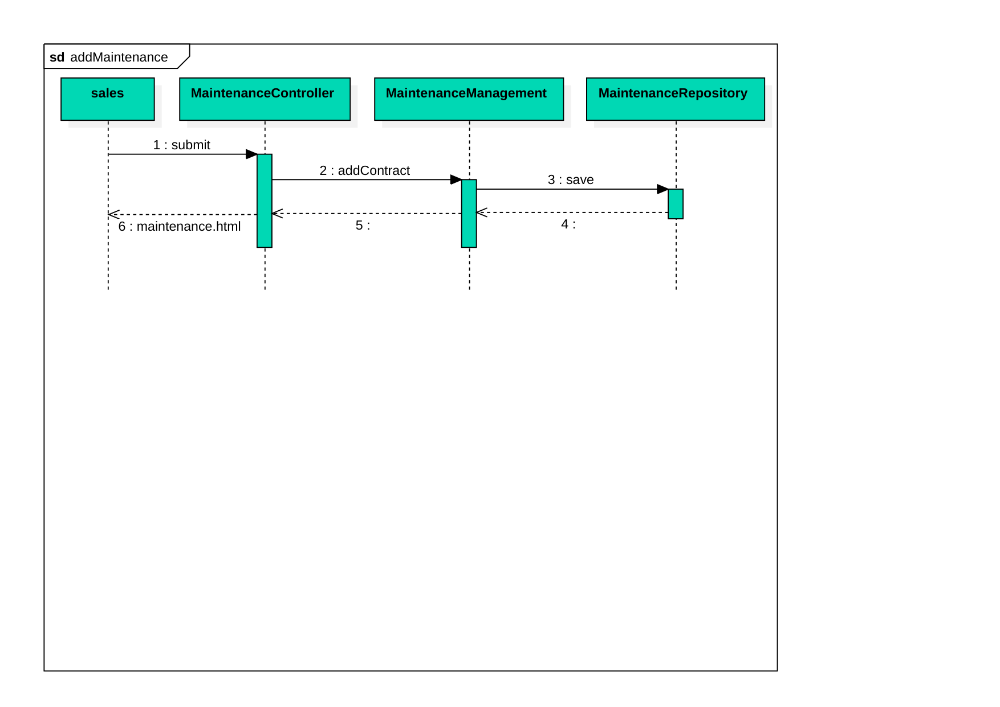

=== GFC

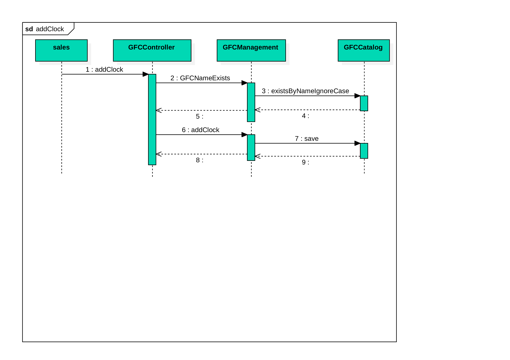

=== Invoice

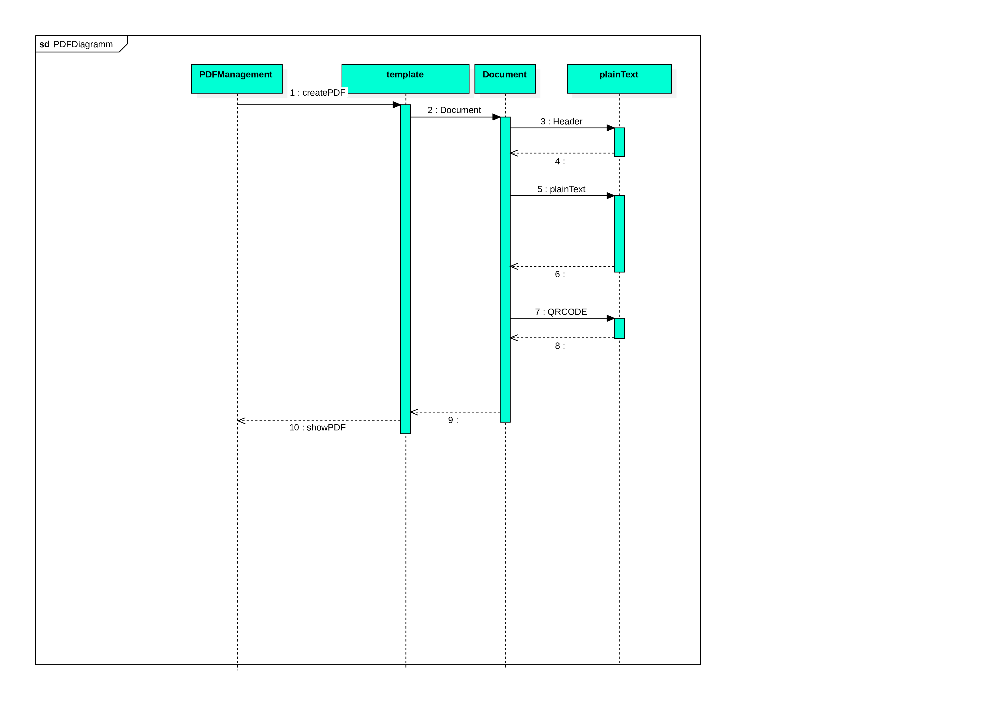

