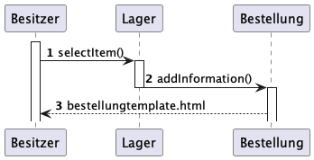
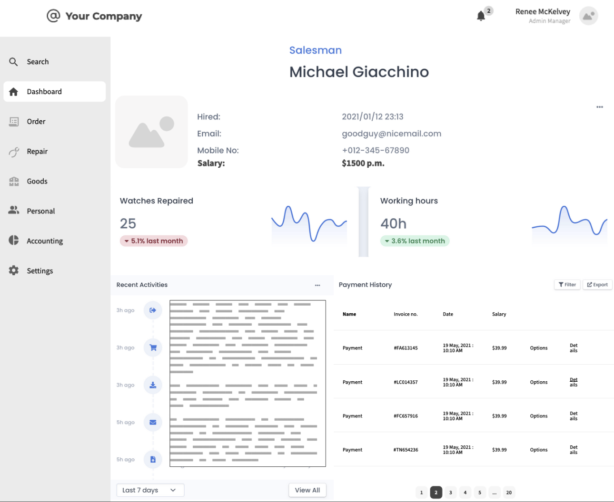

= Pflichtenheft
:project_name: Uhrenladen
:toc:
:toc-title: Inhaltsverzeichnis
:numbered:
== __{project_name}__

[options="header"]
[cols="1, 1, 1, 1, 4"]
|===
|Version | Status      | Bearbeitungsdatum          | Autoren(en) |  Vermerk
|0.1     | In Arbeit   | 10.10.2021                 | Autor       | Initiale Version
|0.5     | In Arbeit (G09)   | 22.10.2023           |  Darius, Felix, Tim| siehe Protokoll
|1.0     | Vollständige Version  | 29.10.2023       | Alle | siehe Protokoll
|===

//== Inhaltsverzeichnis
//??? muss die überschrift dann überhaupt noch?

== Zusammenfassung
Dieses Dokument soll als Leitfaden für das Software-Technologie-Projekt der Gruppe SWT09 im Wintersemester 2023 dienen.
Dabei repräsentiert es das Pflichtenheft(eng. SRS) des Projekts der selbiger Gruppe - die Internetpräsenz eines Uhrenladens technisch umzusetzen.
Idealerweise versteht sich dieses Dokument als Grundlage für die Kommunikation zwischen den einzelnen Interessengruppen.
Vorrangig zwischen Kunde und Entwicklerteam - wobei es gleichzeitig auch Grundgerüst des Vertrages zwischen den beiden Parteien ist.

Im Allgemeinen sind Pflichtenhefte *vollständig, korrekt und konsistent* (CCC). Am Ende des Projektes soll somit
ermittelt werden können, ob das abgelieferte Produkt, der vorangegangenen Abmachung bzw. der Aufgabe entspricht.
Aus diesem Gesichtspunkt heraus sollten die hier definierten Ziele *überprüfbar* und *gut nachvollziehbar* sein.
Da im Projekt mit Umschwüngen in der Anforderungen und Wünschen des Kunden zu rechnen ist,
sollte dieses Dokument - sowie das Projekt an sich - stets gut *anpassbar* sein.

== Aufgabenstellung und Zielsetzung
Im Rahmen des Software-Technologie-Projekts 2023 soll folgende Aufgabe bearbeitet werden:

In einem Laden für Uhren gibt es zwei getrennte Bereiche: Verkauf und Reparatur. Für beide Bereiche
ist entsprechend qualifiziertes Personal nötig.
Im Verkaufsbereich werden Waren angeboten, z.B. Armband- und Taschenuhren, Wecker,
Wanduhren oder Kaminuhren. Das Angebot richtet sich nach aktuellen Trends und Nachfrage der
Kunden und wird in entsprechend benötigten Stückzahlen bei den verschiedenen Herstellern
geordert. Im Lager sind also verschieden große Mengen der Waren vorrätig, in regelmäßigen
Abständen werden Ladenhüter aussortiert und als Verlust verbucht. Es ist auch möglich, Standuhren
zu kaufen. Die werden jedoch vom Kunden individuell aus den Katalogen entsprechender Anbieter
ausgewählt und erst dann bestellt. Neben den Uhren kann man im Laden auch Zubehör (Armbänder,
Batterien etc.) und eine kleine Auswahl an Modeschmuck kaufen. Bringt ein Kunde eine Uhr zur
Reparatur, werden seine Daten aufgenommen und er bekommt eine Auftragsbestätigung. In der
Werkstatt bearbeitet der Uhrmacher alle eingehenden Aufträge nacheinander (Ausnahme: Ein Kunde
wünscht gegen Aufpreis die Reparatur im 24h-Service). Ist die Reparatur erledigt, gibt er den
Materialverbrauch und die benötigte Zeit an. Daraus berechnet sich der Preis und alles zusammen
wird in einer Rechnung für den Kunden zusammengestellt. Der Kunde wird benachrichtigt, sobald
seine Uhr fertig ist. Auch Radiowecker werden zur Reparatur entgegengenommen, diese kann aber
nicht in der eigenen Werkstatt erfolgen. Die Geräte werden zum Hersteller geschickt und von diesem
repariert oder ersetzt, sofern noch Garantieanspruch besteht.
Dem Besitzer des Uhrenladens muss es möglich sein:

* Bestellungen bei den verschiedenen Herstellern zu tätigen
* Verbrauchsmaterial der Werkstatt zu überwachen und nachzubestellen
* das Lager zu führen
* Personal einzustellen und zu entlassen,
* Stundensätze der Uhrmacher festzulegen/zu ändern,
* Abrechnungen (Tag/Monat/Jahr) zu erstellen.

Zukünftig will der Uhrenladen auch einen Wartungsservice für Turm- und Gebäudeuhren anbieten.
Dazu wird mit einem Kunden ein Vertrag geschlossen und je nach Art und Anzahl der Uhren ein
Pauschalbetrag festgesetzt. Materialkosten für eventuell notwendige Reparaturen werden zusätzlich
berechnet. Das Material für Wartung und Reparaturen ist in den Bestellungen zu berücksichtigen,
außerdem muss zusätzliches Personal eingestellt werden.

== Produktnutzung

=== Diese Funktionen sollten alle Vorhanden sein:

Das System wird als Website für das Personal des Uhrenladens gestellt. Der Kunde hat keinen Zugriff. Es wird genutzt um den Angestellten einen Überblick über das Inventar und die Aufträge zu geben. Weiterhin wird die Software das Erstellen von Dokumenten zur rechtlichen Sicherung von Kunden und Firma erstellen können. Die Software soll auf einem Server laufen und jederzeit über den Browser aufrufbar sein.

Das System soll für folgende Browser nutzbar und visuell aufbereitet sein:

    Mozilla Firefox, version 92.0.1+

    Google Chrome, version 94.0.4606+

Das System soll unterscheiden können zwischen der Art der Nutzer in Besitzer (Administrator) und Angestellte (Uhrenmacher und Verkäufer) und deren Aufgaben angepasste Funktionen besitzen.
Das System benötigt keine weitere Wartung. Sämtliche eingespeiste Daten werden anhaltend gespeichert und sind durch das System ohne fachliche Kenntnisse (beispielsweise SQL Kenntnisse)abrufbar.

== Interessensgruppen (Stakeholders)
[options="header", cols="2, ^1, 4, 4"]
|===
|Name
|Wichtigkeit (1..5)
|Beschreibung
|Ziele

|Besitzer des Uhren-Laden
|5
|Hauptkunde des gesamten Projekts.
a|
- mehr Uhren aller Art verkaufen
- Bestellungen bei den verschiedenen Herstellern tätigen
- Verbrauchsmaterial der Werkstatt überwachen und nachzubestellen
- Führung des Lagers
- Personal einstellen und entlassen
- Stundensätze der Uhrmacher festlegen/ändern
- Abrechnungen (Tag/Monat/Jahr) erstellen
- Möglichkeit alle Daten im Systems anzuschauen
- weitere administrative Tätigkeiten

|Mitarbeiter(Uhrmacher)
|3
|Personal das Uhren reparieren kann.
a|
- simple Auftragsübersicht
- Klarer Zeitplan
- einheitliche Bearbeitung von Aufträgen

|Mitarbeiter(Verkäufer)
|3
|Personal das Ware verkaufen kann.
a|
- Verkauf von Ware
- Einsicht in das Lager

|Developers
|4
|Entwickler der Website
a|
- Erweiterbarkeit
- unaufwändige in Standhaltung
- Gute Tests

|===

== Systemgrenze und Top-Level-Architektur

=== Kontextdiagramm

=== Top-Level-Architektur

== Anwendungsfälle

=== Akteure
Akteure sind die Benutzer des Software-Systems oder Nachbarsysteme, welche darauf zugreifen.

// See http://asciidoctor.org/docs/user-manual/#tables
[options="header"]
[cols="1,4"]
|===
|Name                   |Beschreibung
|Personal               |Benutzer mit Rolle Personal, nutzt von Besitzer erstellten Account, kann mit System interagieren, kann Lager einsehen und führt Protokoll über Lagerbestandsänderungen
|Verkäufer              |Personal mit Rolle Verkäufer, verkauft Uhren und Schmuck und nimmt Aufträge für Reparatur an
|Uhrmacher              |Personal mit Rolle Uhrmacher, repariert Uhren, kann Waren umlagern, schließt Wartungsverträge
|Besitzer               |Benutzer mit Rolle Besitzer, managed Personal, kann Lager einsehen und Waren bestellen und aussortieren, kann Kontostand einsehen
|===

=== Überblick Anwendungsfalldiagramm
Anwendungsfall-Diagramm, das alle Anwendungsfälle und alle Akteure darstellt.

=== Anwendungsfallbeschreibungen
Dieser Unterabschnitt beschreibt die Anwendungsfälle. In dieser Beschreibung müssen noch nicht alle Sonderfälle und Varianten berücksichtigt werden. Schwerpunkt ist es, die wichtigsten Anwendungsfälle des Systems zu finden. Wichtig sind solche Anwendungsfälle, die für den Auftraggeber, den Nutzer den größten Nutzen bringen.
Für komplexere Anwendungsfälle ein UML-Sequenzdiagramm ergänzen.
Einfache Anwendungsfälle mit einem Absatz beschreiben.
Die typischen Anwendungsfälle (Anlegen, Ändern, Löschen) können zu einem einzigen zusammengefasst werden.

=== Use-Case Descriptions

Dieser Abschnitt dient der Ausführung der zuvor im Diagramm beschriebenen Anwendungsfälle

[cols="1h, 3"]
[[UC0100]]
|===
|ID                         |**<<UC0100>>**
|Name                       |Ein- und Ausloggen (Verkaufs-Reiter)
|Description                |Dem Verkäufer sollte es möglich sein, dass er sich auf der Internetseite unter dem Verkaufsreiter anmelden kann. Dieser Prozess sollte durch das Abmelden umkehrbar sein.
|Actors                     |Verkäufer
|Trigger                    |
_Einloggen_: Verkäufer meldet sich mit seinem Benutzerkonto an, um die Funktionalität der Internetseite vollumfänglich nutzen kann.

_Ausloggen_: Der Verkäufer möchte die Internetseite verlassen.
|Precondition(s)           a|
_Login_: Der Verkäufer ist noch nicht angemeldet.

_Logout_: Der Verkäufer ist angemeldet.
|Essential Steps           a|
_Einloggen_:

1. Der Verkäufer navigiert zum Anmeldeformular.
2. Der Verkäufer gibt seine Einlogdaten ein.
3. Der Verkäufer drück den "anmelden"-Knopf.
|Extension                         a|
-
|Functional Requirements           a|
<<F0010>>
|===

[cols="1h, 3"]
[[UC0110]]
|===
|ID                         |**<<UC0110>>**
|Name                       |Verkauf
|Description                |Dem Verkäufer sollte es möglich sein Ware zu verkaufen und dementsprechend den Kontostand zu erhöhen.
|Actors                     |Verkäufer
|Trigger                    |
_Einnahme_: Beim Erzielten einer Einnahme sollte der Kontostand sich erhöhen.
_Warenbestand_: Beim Verkauf eines Artikels sollte dieser aus dem Lagerbestand entfernt werden.
|Precondition(s)           a|
_Einnahme_: Der Verkäufer ist angemeldet.

_Warenbestand_: Der zu verkaufende Artikel ist vorrätig.
|Essential Steps           a|
1. Der Verkäufer navigiert in den Verkaufsreiter.
2. Der Verkäufer gibt es Verkaufsdetails ein.
3. Der Verkäufer bestätigt den Verkauf mit einem Klick auf abschicken.
|Extension                         a|
-
|Functional Requirements           a|
<<F0010>><<F0020>><<F0080>>
|===
image::./models/analysis/diagrams/Kontostand_erhohen.png[title= "Sequenzdiagramm Verkauf", align=left]

[[UC0210]]
[cols="1h, 3"]
|===
|ID                         |**<<UC0210>>**
|Name                       |Datenaufnahme
|Description                |Dem Verkäufer sollte es möglich sein die Daten des Kunden im Rahmen der Auftragsbestätigung oder des Verkaufs zu erfassen.
|Actors                     |Verkäufer
|Trigger                    |
_Verkauf_: Beim Verkauf werden Daten des Kunden verarbeitet.

_Reparatur_: Bei der Annahme eines Auftrags zur Reparatur werden Daten des Kunden zur Erstellung der Auftragsbestätigung verarbeitet.
|Precondition(s)           a|
_Angemeldet_: Der Verkäufer ist angemeldet.

_Bestand_: Die verkaufte Dienstleistung / Waren sind verfügbar.
|Essential Steps           a|
_Verkauf_:

1. Der Verkäufer navigiert zum Verkaufsformular.
2. Der Verkäufer gibt die Daten des Kunden ein.
3. Der Verkäufer drück den "abschließen"-Knopf.
|Extension                         a|
-
|Functional Requirements           a|
<<F0010>><<F0020>><<F0120>>
|===
[[UC0220]]
[cols="1h, 3"]
|===
|ID                         |**<<UC0220>>**
|Name                       |Auftragsbestätigung
|Description                |Dem Verkäufer sollte es möglich sein bei der Annahme von Reparaturaufträgen eine Auftragsbestätigung zu generieren.
|Actors                     |Verkäufer
|Trigger                    |.
_Reparatur_: Bei der Annahme eines Auftrags zur Reparatur werden Daten des Kunden zur Erstellung der Auftragsbestätigung verarbeitet.
|Precondition(s)           a|
_Angemeldet_: Der Verkäufer ist angemeldet.
_Bestand_: Die verkaufte Dienstleistung / Waren sind verfügbar.
|Essential Steps           a|
_Reparatur_:

1. Der Verkäufer navigiert zum Reparaturformular.
2. Der Verkäufer gibt die Daten des Kunden ein.
3. Der Verkäufer drück den "abschließen"-Knopf.
|Extension                         a|
-
|Functional Requirements           a|
<<F0010>><<F0020>><<F0100>><<F0120>><<F0150>>
|===
[[UC0230]]
[cols="1h, 3"]
|===
|ID                         |**<<UC0230>>**
|Name                       |Radiowecker
|Description                |Dem Verkäufer sollte es möglich sein den Reparaturauftrag für Radiowecker anzunehmen und diesen dann an den Hersteller zu verschicken.
|Actors                     |Verkäufer
|Trigger                    |.
_Reparatur_: Bei der Annahme eines Auftrags zur Reparatur eines Radioweckers werden Daten des Kunden zur Erstellung der Auftragsbestätigung verarbeitet. Anschließend wird der Status des Produkts auf versendet gesetzt, sobald der Verkäufer es versendet hat.
|Precondition(s)           a|
_Angemeldet_: Der Verkäufer ist angemeldet.
_Bestand_: Die verkaufte Dienstleistung / Waren sind verfügbar.
|Essential Steps           a|
_Reparatur_:

1. Der Verkäufer navigiert zum Reparaturformular.
2. Der Verkäufer wählt aus, dass es sich um einen Radiowecker handelt.
3. Der Verkäufer gibt die Daten des Kunden ein.
4. Der Verkäufer drück den "abschließen"-Knopf.
|Extension                         a|
-
|Functional Requirements           a|
<<F0010>><<F0100>><<F0120>><<F0150>>
|===
[[UC0240]]
[cols="1h, 3"]
|===
|ID                         |**<<UC0240>>**
|Name                       |Reparatur
|Description                |Dem Uhrmacher sollte es möglich sein bei der Reparatur Waren einzusetzen und somit zu verringern und dementsprechend den Kontostand zu erhöhen.
|Actors                     |Uhrmacher
|Trigger                    |
_Reparatur_: Bei der Reparatur werden Waren eingesetz und durch Arbeit Geld generiert.
|Precondition(s)           a|
_Login_: Der Uhrmacher ist angemeldet.
_Bestand_: Die verkaufte Dienstleistung / Waren sind verfügbar.
|Essential Steps           a|
_Reparatur_:

1. Der Uhrmacher startet die Arbeit am Auftrag.
2. Der Uhrmacher entnimmt Ware aus dem Lager

|Extension                         a|
-
|Functional Requirements           a|
<<F0010>><<F0080>><<F0100>>
|===

[[UC0250]]
[cols="1h, 3"]
|===
|ID                         |**<<UC0250>>**
|Name                       |Rechnung
|Description                |Dem Uhrmacher sollte es möglich sein eine Rechnung zu erstellen, die Material- und Zeitkosten berücksichtigt.
|Actors                     |Uhrmacher
|Trigger                    |
_Reparatur_: Bei der Reparatur werden Waren eingesetz.
|Precondition(s)           a|
_Login_: Der Uhrmacher ist angemeldet.

_Bestand_: Die verkaufte Dienstleistung / Waren sind verfügbar.
|Essential Steps           a|
_Reparatur_:

1. Der Uhrmacher startet die Arbeit am Auftrag.
2. Der Uhrmacher schließt die Arbeit ab und erstellt die Rechnung.

|Extension                         a|
-
|Functional Requirements           a|
<<F0010>><<F0140>>
|===
[[UC0300]]
[cols="1h, 3"]
|===
|ID                         |**<<UC0300>>**
|Name                       |Waren erfassen
|Description                |Dem gesamten Personal sollte es möglich sein Ware zu erfassen und deren Artikelstandort anzugeben.
|Actors                     |Uhrmacher, Verkäufer
|Trigger                    |
_Lieferung_: Zuvor bestellte Artikel kommen an.
|Precondition(s)           a|
_Login_: Der Mitarbeiter ist angemeldet.
|Essential Steps           a|
_Lager_:

1. Der Mitarbeiter navigiert zur Bestellübersicht.
2. Der Benutzer erhält eine Übersicht der bestellten Güter und kann diesen jetzt einen Standort zuweisen. (Regal a-e)

|Extension                         a|
-
|Functional Requirements           a|
<<F0010>><<F0040>><<F0050>>
|===
[[UC0310]]
[cols="1h, 3"]
|===
|ID                         |**<<UC0310>>**
|Name                       |Waren aussortieren
|Description                |Dem Besitzer sollte es möglich sein, Artikel auszusortieren.
|Actors                     |Besitzer
|Trigger                    |
_Anfrage_: Knopf im Lager-Tab zum Löschen von Artikeln.
|Precondition(s)           a|
_Login_: Der Besitzer ist angemeldet.
|Essential Steps           a|
_Lager_:

1. Der Besitzer navigiert zum Lager-Tab.
2. Der Besitzer löscht via Knopfdruck alle Artikel, die aussortiert werden müssen.

|Extension                         a|
-
|Functional Requirements           a|
<<F0010>><<F0120>>
|===
[[UC0320]]
[cols="1h, 3"]
|===
|ID                         |**<<UC0320>>**
|Name                       |Waren umlagern
|Description                |Den Mitarbeitern sollte es möglich sein den Artikelstandort eines Artikels zu ändern.
|Actors                     |Uhrmacher, Verkäufer, Besitzer
|Trigger                    |
_Anfrage_: Knopf im Lager-Tab zum Umlagern von Artikeln.
|Precondition(s)           a|
_Login_: Der Mitarbeiter/Besitzer ist angemeldet.
|Essential Steps           a|
_Lager_:

1. Der Benutzer navigiert zum Lager-Tab.
2. Der Benutzer drück einen Knopf zum Umlagern eines Artikels und gibt den neuen Artikelstandort an. (Regal a-e)

|Extension                         a|
-
|Functional Requirements           a|
<<F0010>><<F0020>>
|===
    
[[UC0330]]
[cols="1h, 3"]
|===
|ID                         |**<<UC0330>>**
|Name                       |Protokoll
|Description                |Den Mitarbeitern sollte es möglich sein, Artikelbewegungen in einem Protokoll zu verfolgen.
|Actors                     |Uhrmacher, Verkäufer, Besitzer
|Trigger                    |
_Anfrage_: Reiter im Lager-Tab
|Precondition(s)           a|
_Login_: Der Mitarbeiter/Besitzer ist angemeldet.
|Essential Steps           a|
_Lager_:

1. Der Benutzer navigiert zum Lager-Tab.
2. Der Benutzer drück auf den Protokoll-Reiter.

|Extension                         a|
-
|Functional Requirements           a|
<<F0010>><<F0020>>
|===

[[UC0410]]
[cols="1h, 3"]
|===
|ID                         |**<<UC0410>>**
|Name                       |Waren bestellen
|Description                |Dem Besitzer sollte es möglich sein, Ware zu bestellen und diese an das Lager zu überweisen. Dabei wird ein Template mit Stückzahl und Hersteller erstellt.
|Actors                     |Besitzer
|Trigger                    |
_Anfrage_: Der Besitzer wählt die zu bestellenden Artikel aus.
|Precondition(s)           a|
_Login_: Der Besitzer ist angemeldet.
|Essential Steps           a|
_Lager_:

1. Der Besitzer navigiert zum Lager-Tab.
2. Der Besitzer wählt die zu bestellenden Artikel aus.
3. Der Besitzer erhält ein Template - eine Art Bestellbestätigung, die die Stückzahl und den Hersteller der bestellten Güter enthält.

|Extension                         a|
-
|Functional Requirements           a|
<<F0010>><<F0030>>
|===

[[UC0420]]
[cols="1h, 3"]
|===
|ID                         |**<<UC0420>>**
|Name                       |Kontostand einsehen
|Description                |Dem Besitzer sollte es möglich sein, den Kontostand des Geschäfts einzusehen.
|Actors                     |Besitzer
|Trigger                    |
_Anfrage_: Der Besitzer fragt den Kontostand auf der Internetseite an.
|Precondition(s)           a|
_Login_: Der Besitzer ist angemeldet.
|Essential Steps           a|
_Finanzen_:

1. Der Besitzer navigiert zum Finanzen-Tab.
2. Der Besitzer sieht eine Übersicht der Finanzen, dabei den Kontostand.

|Extension                         a|
-
|Functional Requirements           a|
<<F0010>>
|===

[[UC0430]]
[cols="1h, 3"]
|===
|ID                         |**<<UC0430>>**
|Name                       |Lagerstand einsehen
|Description                |Dem Besitzer sollte es möglich sein den Lagerbestand einzusehen.
|Actors                     |Besitzer
|Trigger                    |
_Anfrage_: Anfrage durch Mitarbeiter gibt Lagerbestand zurück.
|Precondition(s)           a|
_Login_: Der Besitzer ist angemeldet.
|Essential Steps           a|
_Lager_:

1. Der Besitzer navigiert zum Lager-Tab.
2. Der Besitzer erhält eine Übersicht der Güter im Lager und deren Standort (Regal a-e).

|Extension                         a|
-
|Functional Requirements           a|
<<F0010>><<F0020>>
|===
[[UC0440]]
[cols="1h, 3"]
|===
|ID                         |**<<UC0440>>**
|Name                       |Personal managen
|Description                |Dem Besitzer sollte es möglich das Personal zu managen. Dieser kann neue Mitarbeiter einstellen, Mitarbeiter entlassen und deren Stundensätze bearbeiten.
|Actors                     |Besitzer
|Trigger                    |
_Anfrage_: Anfrage im Personal-Tab durch den Besitzer.
|Precondition(s)           a|
_Login_: Der Besitzer ist angemeldet.
|Essential Steps           a|
_Personal_:

1. Der Besitzer navigiert zum Personal-Tab.
2. Der Besitzer erhält eine Übersicht über das angestellte Personal und deren Stundensätze.
3. Über verschiedene Knöpfe: einstellen, bearbeiten und entlassen - kann der Besitzer sein Personal verwalten.

|Extension                         a|
-
|Functional Requirements           a|
<<F0010>><<F0180>><<F0190>><<F0200>><<F0210>>
|===
[[UC0450]]
[cols="1h, 3"]
|===
|ID                         |**<<UC0450>>**
|Name                       |Stundensätze
|Description                |Dem Besitzer sollte es möglich sein, die Stundensätze seines Personals einzusehen und zu bearbeiten.
|Actors                     |Besitzer
|Trigger                    |
_Anfrage_: Anfrage im Personal-Tab durch den Besitzer.
|Precondition(s)           a|
_Login_: Der Besitzer ist angemeldet.
|Essential Steps           a|
_Personal_:

1. Der Besitzer navigiert zum Personal-Tab.
2. Der Besitzer erhält eine Übersicht über das angestellte Personal und deren Stundensätze.
3. Der Besitzer kann hier die Stundensätze bearbeiten.

|Extension                         a|
-
|Functional Requirements           a|
<<F0010>><<F0210>>
|===
[[UC0460]]
[cols="1h, 3"]
|===
|ID                         |**<<UC0460>>**
|Name                       |Abrechnungen
|Description                |Dem Besitzer sollte es möglich sein, die Abrechnungen einzusehen.
|Actors                     |Besitzer
|Trigger                    |
_Anfrage_: Anfrage im Personal-Tab durch den Besitzer.
|Precondition(s)           a|
_Login_: Der Besitzer ist angemeldet.
|Essential Steps           a|
_Finanzen_:

1. Der Besitzer navigiert zum Finanzen-Tab.
2. Der Besitzer navigiert zum Abrechnungen-Reiter.
3. Der Besitzer erhält eine Übersicht aller erstellten Abrechnungen.

|Extension                         a|
-
|Functional Requirements           a|
<<F0010>><<F0200>>
|===

[[UC0500]]
[cols="1h, 3"]
|===
|ID                         |**<<UC0500>>**
|Name                       |Vertrag schließen
|Description                |Den Uhrmachern sollte es möglich sein, Verträge für Turm- und Gebäudeuhren zu schließen.
|Actors                     |Uhrmacher
|Trigger                    |
_Anfrage_: Anfrage im Auftrags-Tab.
|Precondition(s)           a|
_Login_: Der Uhrmacher ist angemeldet.
|Essential Steps           a|
_Auftrag_:

1. Der Mitarbeiter navigiert zu den Aufträgen.
2. Der Mitarbeiter trägt die Auftragsdetails ein.
3. Der Mitarbeiter bestätigt dies mit einem Klick auf bestätigen.

|Extension                         a|
-
|Functional Requirements           a|
<<F0010>><<F0160>>
|===

== Funktionale Anforderungen

[options="header", cols="4, 3, 4, 5, 4"]
|===
| ID | Version | Name | Beschreibung | Berechtigung

| [[F0010]]<<F0010>>
| v.01
| Authentifizierung
| Der im System existierende Nutzer muss sich durch Angabe von Benutzernamen und Passwort. DasSystem hierzu muss öffentlich verfügbar sein.
| Jeder

| [[F0020]]<<F0020>>
| v.01
| Inventar sehen
| Das System muss die im Lager verfügbaren Produkte in einem Inventar sichtbar machen.
| Jeder

| [[F0030]]<<F0030>>
| v.01
| Inventar speichern
| Das Inventar muss mit allen Elementen und Editierungen automatisch speicherbar und erneut aufrufbar sein.
| Jeder

| [[F0040]]<<F0040>>
| v.01
| Ware erstellen
| Dem Inventar müssen neue Waren hinzugefügt werden.
| Besitzer

| [[F0050]]<<F0050>>
| v.01
| Warenbeschreibung erstellen
| Beim Erstellen von Waren müssen die Eigenschaften vom Nutzer gesetzt werden. Die eingegebenen Werte werden gespeichert.
| Besitzer

| [[F0060]]<<F0060>>
| v.01
| Warenbeschreibung editieren
| Die Eigenschaften der Waren müssen editierbar sein. Auch nach dem Erstellen.
| Besitzer

| [[F0070]]<<F0070>>
| v.01
| Bestandteile reduzieren, erhöhen
| Die Reparaturmaterialien müssen in ihrer Anzahl editierbar sein.
| Uhrmacher

| [[F0080]]<<F0080>>
| v.01
| Bestand reduzieren
| Der Bestand der Waren im Inventar sollte bei Verkäufen automatisch verringert werden. Bei ungeplantem Materialverlust soll der Admin die Warenanzahl auch per Hand verringern können.
| Verkäufer

| [[F0090]]<<F0090>>
| v.01
| Bestand erhöhen
| Der Bestand der Waren im Inventar kann manuell erhöht werden.
| Besitzer

| [[F0100]]<<F0100>>
| v.01
| Aufträge einsehen
| Die vom Verkäufer erstellten Aufträge sollen vom Uhrenmacher eingesehen werden können.
| Uhrmacher

| [[F0110]]<<F0110>>
| v.01
| Auftragsstatus ändern
| Der Auftragsstatus soll manuell verändert werden können. Dabei sind folgende Zustände verfügbar: FERTIG, IN BEARBEITUNG, OFFEN, ERROR.
| Uhrmacher

| [[F0120]]<<F0120>>
| v.01
| Auftrag erstellen
| Das System soll das Erstellen neuer Aufträge unterstützen und das Angeben aller erforderlichen Daten zum Kunden und zum Auftrag abfragen.
| Verkäufer

| [[F0130]]<<F0130>>
| v.01
| Bestellung Dok erstellen
| Das System soll eine bei der Erstellung editierbare Datei im Format .pdf für Material- und Warenbestellungen bei externen Firmen erstellen können.
| Besitzer

| [[F0140]]<<F0140>>
| v.01
| Rechnung Dok erstellen
| Das System soll eine Datei im Format .pdf für Verkauf einer Ware erstellen können. Alle für den Verkauf relevanten Daten werden im Dokument angegeben.
| Uhrmacher

| [[F0150]]<<F0150>>
| v.01
| Empfangsbestätigung Dok erstellen
| Das System soll eine Datei im Format .pdf für die Entgegennahme einer Ware zur Reparatur erstellen können. Alle relevanten Daten sollen abgefragt werden.
| Verkäufer

| [[F0160]]<<F0160>>
| v.01
| Wartungsservice Dok erstellen
| Das System soll eine Datei im Format .pdf für die Wartung externer Turm- und Standuhren erstellen können. Alle relevanten Daten sollen abgefragt werden.
| Verkäufer

| [[F0170]]<<F0170>>
| v.01
| Bestellungen sehen
| Das System soll alle bereits aufgegebenen Bestellungen an externe Firmen mit ihren essenziellen Eigenschaften anzeigen können.
| Uhrenmacher

| [[F0180]]<<F0180>>
| v.01
| Nutzer erstellen
| Das System soll neue Nutzer für das System erstellen können. Dabei sollen der Nutzername und das Passwort die zur Authentifizierung gebraucht werden gesetzt weren können.
| Besitzer

| [[F0190]]<<F0190>>
| v.01
| Nutzer löschen
| Nutzer des Systems (ausgeschlossen des Administrators) sollen entfernt werden können. Die Authentifizierung mit dem vorher verfügbarern Nutzernamen und Passwort ist nicht mehr möglich.
| Besitzer

| [[F0200]]<<F0200>>
| v.01
| Nutzer sehen
| Alle Nutzer des Systems sollen mit ihren wesentlichen Eigenschaften sichtbar sein.
| Besitzer

| [[F0210]]<<F0210>>
| v.01
| Nutzer editieren
| Alle Nutzer des Systems sollen manuell editierbare Eigenschaften besitzen. Diese werden dauerhaft gespeichert.
| Besitzer

|===

=== Kann-Kriterien
[options="header", cols="4, 4, 2, 6, 4"]
|===
| ID | Version | Name | Beschreibung | Berechtigung
| P0010 | v.01 | Anwesenheitsverwaltung | Der Nutzer kann manuell seine absolvierte Arbeitszeit eintragen. | Jeder
| P0020 | v.01 | Authentifizierungszeiten | Der Nutzer kann die Login- und Logoutzeiten der Arbeiter sehen. | Besitzer
| P0030 | v.01 | weitere persönliche Angaben | Der Nutzer muss weiter arbeitsrelevante Daten in seinem Nutzerprofil angegeben haben um auf das System zugreifen zu können. | Jeder
|===

== Nicht-Funktionale Anforderungen

=== Qualitätsziele
[options="header", cols="4, 1, 1, 1, 1, 1"]
|===
| Qualitätsanforderung  | 1 | 2 | 3 | 4 | 5
| Nutzbarkeit           |  |  |  | x |
| Sicherheit            |  |  |  | x |
| Speicher              |  | x |  |  |
| Übersichtlichkeit     |  |  | x |  |
| Fehlertoleranz        |  |  | x |  |
| Korrektheit           |  |  |  |  | x
| Erweiterbarkeit       |  |  |  |  | x
|===

=== Konkrete Nicht-Funktionale Anforderungen

[options="header", cols="2h, 1, 3, 12"]
|===
|ID |Version |Name |Description

|[[N0010]]<<N0010>>
|v0.1 |Verfügbarkeit - online zugreifbar
a|
Das System soll mindestens 99,5% der Zeit online zugreifbar sein.

|[[N0020]]<<N0020>>
|v0.1|Sicherheit - Passwort Speicher
a|
Zum Verhindern von Diebstahl sollen die Passwörter von Nutzern nur als Hash-Werte gespeichert werden.

|[[N0030]]<<N0030>>
|v0.1|Übersichtlichkeit - Anzahl Websites
a|
Für übersichtliche Websites werden verschiedene Funktionen unter unterschiedlichen URLs gelistet.

|===

== GUI Prototyp

image::./models/analysis/images/login.png[title= "Login vom {project_name}. Standard Startseite für uneingeloggte Besucher der Website.", align=left]

//Protokoll? nur Besitzer

Reparaturen Details ist ähnlich wie Orders Details

== Datenmodell

=== Überblick: Klassendiagramm

NICHT FINALES DIAGRAMM

=== Klassen und Enumerationen
Dieser Abschnitt stellt eine Vereinigung von Glossar und der Beschreibung von Klassen/Enumerationen dar. Jede Klasse und Enumeration wird in Form eines Glossars textuell beschrieben. Zusätzlich werden eventuellen Konsistenz- und Formatierungsregeln aufgeführt.

// See http://asciidoctor.org/docs/user-manual/#tables
[options="header", cols="1h, 4"]
[[classes_enumerations]]
|===
|Klasse/Enumeration             |Beschreibung

|Uhrenladen                     |Hauptklasse des Systems.

// Nutzer
|Unregistrierter Nutzer         |Nicht eingeloggter Besucher der Website, darf nicht außer sich anzumelden.
|Registrierter Nutzer           |Eingeloggter Nutzer des Uhrenladensystems.
|Personal                       |Nutzergruppe des Uhrenladens, welche Rechte basierend auf ihren Aufgaben haben.
|Verkäufer                      |Ein registrierter Nutzer, der die Rechte hat Ware zu verkaufen.
|Uhrenmacher                    |Ein registrierter Nutzer, der die Rechte hat Aufträge in der Werkstatt zu bearbeiten und nach Abschluss Rechnungen zu stellen.
|Besitzer                       |Nutzer mit allen rechten im System. Der einzige Nutzer, welcher den Kontostand und das Lagerprotokoll einsehen darf.

//Lagerzeug
|Lager                          |Objekt, welches alle Lageritems beinhaltet und ein Protokoll über alle Transaktionen speichert.
|Konto                          |Speichert die Kontodaten des Ladens.
|Protokoll                      |Speicherort für alle Interaktionen mit dem Lager.
|Lageritem                      |Abstraktes Objekt. Ist die Elternklasse für alle Items, die existieren.
|Uhren                          |Repräsentativ für alle verschieden Uhrenarten im Uhrenladen.
|Accessoire                     |Verkaufbarer Gegenstand, der keine Uhr ist.
|Material                       |Items, welche für die Reparatur genutzt und verbraucht werden.

// Template
|Texttemplate                   |Abstrakte Klasse für Templates welche für Generierung verschiedener Dokumente genutzt wird
|Rechung                        |Dokument, wird nach Verkauf ausgestellt.
|Auftragsbestätigung            |Dokument, welches nach Entgegenname von zu reparierenden Gegenständen ausgestellt wird.
|Bestellung                     |Dokument für Nachbestellung von Ware durch den Besitzer.
|Wartungsservice                |Dokument, welches für die Wartung von Großuhren erstellt wird

// Werkstatt
|Werkstatt                      |Objekt, welches alle Aufträge für Reparaturen speichert.
|Status                         |Diese Enumeration gibt den Status, der in der Werkstatt gespeicherten Aufträge an.
|Kunde                          |Objekt in dem die Kundendaten gespeichert werden, welche für verschiedene Templates genutzt werden
|===

== Akzeptanztestfälle

:Pre: Precondition(s)
:Event: Event
:Result: Expected Result

[cols="1h, 4"]
[[AT0100]]
|===
|ID            |<<AT0100>>
|Use Case      |<<UC0100>>
|{Pre}        a|Das System verfügt über bestehende Verkäufer.
|{Event}      a| 
1. Ein nicht authentifizierter Benutzer navigiert zum Anmeldeformular.
2. Er gibt seine Einlogdaten ein (login: „seller“, pass: „123“).
3. Der Benutzer drück den "Anmelden"-Knopf. 
|{Result}     a|
- Der Benutzer ist nun als „Verkäufer“ authentifiziert
- Der Verkäufer wird zu einem Willkommensbildschirm weitergeleitet, der eine personalisierte Willkommensnachricht anzeigt
- Der Benutzer hat nun Zugriff auf alle Funktionen, die Benutzern mit der Rolle „Verkäufer“ zugänglich sind
|===	
[cols="1h, 4"]
[[AT0110]]
|===
|ID            |<<AT0110>>
|Use Case      |<<UC0100>>
|{Pre}        a|Authentifizierter Verkäufer verwendet das System
|{Event}      a|Authentifizierter Verkäufer drückt „Ausloggen“-Knopf
|{Result}     a|
- Er wird unauthentifiziert
- Er verliert jeglichen Zugriff auf Funktionen, die nur authentifizierten Benutzern oder bestimmten Rollen(„Verkäufer“) offen stehen
|===
[cols="1h, 4"]
[[AT0120]]
|===
|ID            |<<AT0120>>
|Use Case      |<<UC0110>>
|{Pre}        a| 
- Das System verfügt über bestehende Verkäufer			
|{Event}      a|Der Verkäufer bestätigt den Verkauf mit einem Klick auf abschicken.
|{Result}     a|Beim erzielten einer Einnahme wird der Kontostand sich erhöhen.
|===
[cols="1h, 4"]
[[AT0200]]
|===
|ID            |<<AT0200>>
|Use Case      |<<UC0100>>
|{Pre}        a|Das System verfügt über bestehende Uhrmacher.
|{Event}      a|Der Benutzer meldet sich als Uhrmacher an.(log: “watchmaker“, pas:“123“)
|{Result}     a|
- Der Benutzer ist nun als „Uhrmacher“ authentifiziert
- Der Uhrmacher wird zu einem Willkommensbildschirm weitergeleitet, der eine personalisierte Willkommensnachricht anzeigt
- Der Benutzer hat nun Zugriff auf alle Funktionen, die Benutzern mit der Rolle  „Uhrmacher“ zugänglich sind
|===
[cols="1h, 4"]
[[AT0210]]
|===
|ID            |<<AT0210>>
|Use Case      |<<UC0100>>
|{Pre}        a|Authentifizierter Uhrmacher verwendet das System
|{Event}      a|Authentifizierter Uhrmacher drückt „Ausloggen“-Knopf
|{Result}     a|
- Er wird unauthentifiziert
- Er verliert jeglichen Zugriff auf Funktionen, die nur authentifizierten Benutzern oder bestimmten Rollen(„Uhrmacher“) offen stehen
|===
[cols="1h, 4"]
[[AT0220]]
|===
|ID            |<<AT0220>>
|Use Case      |<<UC0210>>
|{Pre}        a|
- Authentifizierter Verkäufer verwendet das System
- Die verkaufte Dienstleistung / Waren sind verfügbar.
|{Event}      a| 
1. Der Verkäufer navigiert zum Verkaufsformular.
2. Der Verkäufer gibt die Daten des Kunden ein.
3. Der Verkäufer drück den "abschließen"-Knopf.
|{Result}     a|Die Daten des Kunden wurden gespeichert. 
|===
[cols="1h, 4"]
[[AT0230]]
|===
|ID            |<<AT0230>>
|Use Case      |<<UC0220>>
|{Pre}        a|
- Authentifizierter Verkäufer verwendet das System
- Die verkaufte Dienstleistung / Waren sind verfügbar.
|{Event}      a| 
1. Der Verkäufer navigiert zum Reparaturformular.
2. Der Verkäufer gibt die Daten des Kunden ein.
3. Der Verkäufer drück den "abschließen"-Knopf.
|{Result}     a|Die Auftragsbestätigung bei der Annahme von Reparaturaufträge wird generiert  
|===
[cols="1h, 4"]
[[AT0240]]
|===
|ID            |<<AT0240>>
|Use Case      |<<UC0230>>
|{Pre}        a|
- Authentifizierter Verkäufer verwendet das System
- Die verkaufte Dienstleistung / Waren sind verfügbar.
|{Event}      a| 
1. Der Verkäufer navigiert zum Reparaturformular.
2. Der Verkäufer wählt aus, dass es sich um einen Radiowecker handelt.
3. Der Verkäufer gibt die Daten des Kunden ein.
4. Der Verkäufer drück den "abschließen"-Knopf.
|{Result}     a| Auftrag zur Reparatur eines Radioweckers wurde erstellt. 
Der Verkäufer sendet das Produkt an den Hersteller und ändert den Status des Produkts auf „IN BEARBEITUNG“.

|===
[cols="1h, 4"]
[[AT0250]]
|===
|ID            |<<AT0250>>
|Use Case      |<<UC0240>>
|{Pre}        a|
- Der Uhrmacher ist angemeldet.
- Die verkaufte Dienstleistung / Waren sind verfügbar.
|{Event}      a| 
1. Der Uhrmacher startet die Arbeit am Auftrag.
2. Der Uhrmacher entnimmt Ware aus dem Lager
|{Result}     a| Die Menge der vorrätigen Waren ist zurückgegangen
|===

[cols="1h, 4"]
[[AT0300]]
|===
|ID            |<<AT0300>>
|Use Case      |<<UC0300>>
|{Pre}        a| Der Mitarbeiter ist angemeldet.
|{Event}      a| Der Mitarbeiter navigiert zur Bestellübersicht.

|{Result}     a| Der Benutzer erhält eine Übersicht der bestellten Güter
|===

[cols="1h, 4"]
[[AT0310]]
|===
|ID            |<<AT0310>>
|Use Case      |<<UC0310>>
|{Pre}        a| Der Besitzer ist angemeldet.
|{Event}      a| 
1. Der Besitzer navigiert zum Lager-Tab.
2. Der Besitzer löscht via Knopfdruck alle Artikel, die aussortiert werden müssen.
|{Result}     a| Alle ausgewählten Artikeln wurden gelöscht.
|===
[cols="1h, 4"]
[[AT0320]]
|===
|ID            |<<AT0320>>
|Use Case      |<<UC0320>>
|{Pre}        a| Der Mitarbeiter/Besitzer ist angemeldet.
|{Event}      a| 
1. Der Benutzer navigiert zum Lager-Tab.
2. Der Benutzer drück einen Knopf zum Umlagern eines Artikels und gibt den neuen Artikelstandort an. (Regal a-e)
|{Result}     a| Artikel wurden umgelagert und neuen Standorten zugeordnet
|===
[cols="1h, 4"]
[[AT0330]]
|===
|ID            |<<AT0330>>
|Use Case      |<<UC0330>>
|{Pre}        a| Der Mitarbeiter/Besitzer ist angemeldet.
|{Event}      a| Der Benutzer navigiert zum Lager-Tab und klickt auf den Protokoll-Reiter.
|{Result}     a| In dem geöffneten Protokoll sind Artikelbewegungen sichtbar.
|===

[cols="1h, 4"]
[[AT0400]]
|===
|ID            |<<AT0400>>
|Use Case      |<<UC0100>>
|{Pre}        a|Der Besitzer ist noch nicht angemeldet
|{Event}      a|
1. Der Benutzer navigiert zum Anmeldeformular.
2. Der Benutzer gibt seine Einlogdaten ein.(log:“boss“, pass:“123“)
3. Der Benutzer drück den "anmelden"-Knopf.
|{Result}     a| 
- Der Benutzer ist nun als „Besitzer“ authentifiziert
- Der Besitzer wird zu einem Willkommensbildschirm weitergeleitet, der eine personalisierte Willkommensnachricht anzeigt
- Der Benutzer hat nun Zugriff auf alle Funktionen, die Benutzern mit der Rolle „Besitzer“ zugänglich sind

|===
[cols="1h, 4"]
[[AT0410]]
|===
|ID            |<<AT0410>>
|Use Case      |<<UC0100>>
|{Pre}        a|Authentifizierter Besitzer verwendet das System
|{Event}      a|Authentifizierter Besitzer drückt „Ausloggen“-Knopf
|{Result}     a|
- Er wird unauthentifiziert
- Er verliert jeglichen Zugriff auf Funktionen, die nur authentifizierten Benutzern oder bestimmten Rollen(„Besitzer“) offen stehen
|===

[cols="1h, 4"]
[[AT0420]]
|===
|ID            |<<AT0420>>
|Use Case      |<<UC0410>>
|{Pre}        a|Authentifizierter Besitzer verwendet das System
|{Event}      a|Authentifizierter Besitzer navigiert zum Lager-Tab und wählt die zu bestellenden Artikel aus.
|{Result}     a|
Ein Template wird erhalten, welches eine Art Bestellbestätigung darstellt und die Stückzahl sowie den Hersteller der bestellten Güter enthält.
|===

[cols="1h, 4"]
[[AT0430]]
|===
|ID            |<<AT0430>>
|Use Case      |<<UC0420>>
|{Pre}        a|Authentifizierter Besitzer verwendet das System
|{Event}      a|Der Besitzer navigiert zum Finanzen-Tab.
|{Result}     a|
Es wird eine Übersicht der Finanzen gesehen, einschließlich des Kontostandes.
|===
[cols="1h, 4"]
[[AT0440]]
|===
|ID            |<<AT0440>>
|Use Case      |<<UC0440>>
|{Pre}        a|Authentifizierter Besitzer verwendet das System
|{Event}      a|Der Besitzer navigiert zum Personal-Tab.
|{Result}     a|
Es wird eine Übersicht der Mitarbeiter mit Management-Funktionen(kann neue Mitarbeiter einstellen, Mitarbeiter entlassen und deren Stundensätze bearbeiten) gesehen.
|===
[cols="1h, 4"]
[[AT0450]]
|===
|ID            |<<AT0450>>
|Use Case      |<<UC0460>>
|{Pre}        a|Authentifizierter Besitzer verwendet das System
|{Event}      a|Der Besitzer navigiert zum Abrechnungen-Reiter im Personal-Tab.
|{Result}     a|Der Besitzer erhält eine Übersicht aller erstellten Abrechnungen.
|===

[cols="1h, 4"]
[[AT0500]]
|===
|ID            |<<AT0500>>
|Use Case      |<<UC0500>>
|{Pre}        a|Der Uhrmacher ist angemeldet.
|{Event}      a|Der Mitarbeiter navigiert zu den Aufträgen, trägt die Auftragsdetails ein und bestätigt dies mit einem Klick auf "Bestätigen".
|{Result}     a| Der Vertrag ist abgeschlossen
|===

== Glossar
Sämtliche Begriffe, die innerhalb des Projektes verwendet werden und deren gemeinsames Verständnis aller beteiligten Stakeholder essenziell ist.

:Klassendiagramm: siehe  <<classes_enumerations, Klassendiagramm>>

[options="header", cols="1h, 4"]
[[glossar]]
|===
|Begriff                    |Beschreibung

|System                     |Gesamtheit der Software

//Personen
|Besitzer                   |{Klassendiagramm}
|Boss                       |Synonym für Besitzer
|Verkäufer                  |{Klassendiagramm}
|Uhrmacher                  |{Klassendiagramm}

//Begriff in Zusammenhang mit dem Lager
|Lager                      |{Klassendiagramm}
|Waren                      |Überbegriff für zu verkaufende Güter
|Artikel                    |Meint alle Güter, die sich im Lager des Uhrenladens bewegen und für dessen Funktion relevant sind.
|Uhr                        |{Klassendiagramm}

|Protokoll                  |{Klassendiagramm}
|Artikelbewegungen          |Meint alle Veränderungen im Zustand eines Artikels, also u.a. den Standort oder die Anzahl
|Konto                      |{Klassendiagramm}
|Werkstatt                  |{Klassendiagramm}
|Kunde                      |{Klassendiagramm}
|===

== Offene Punkte

* keine offenen Punkte
